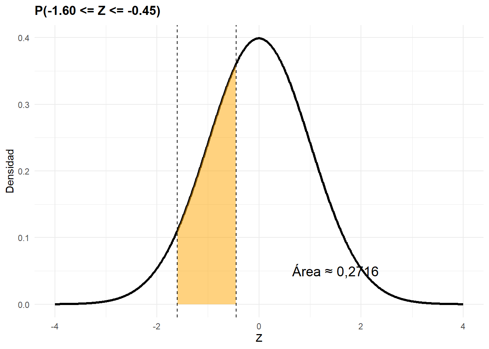
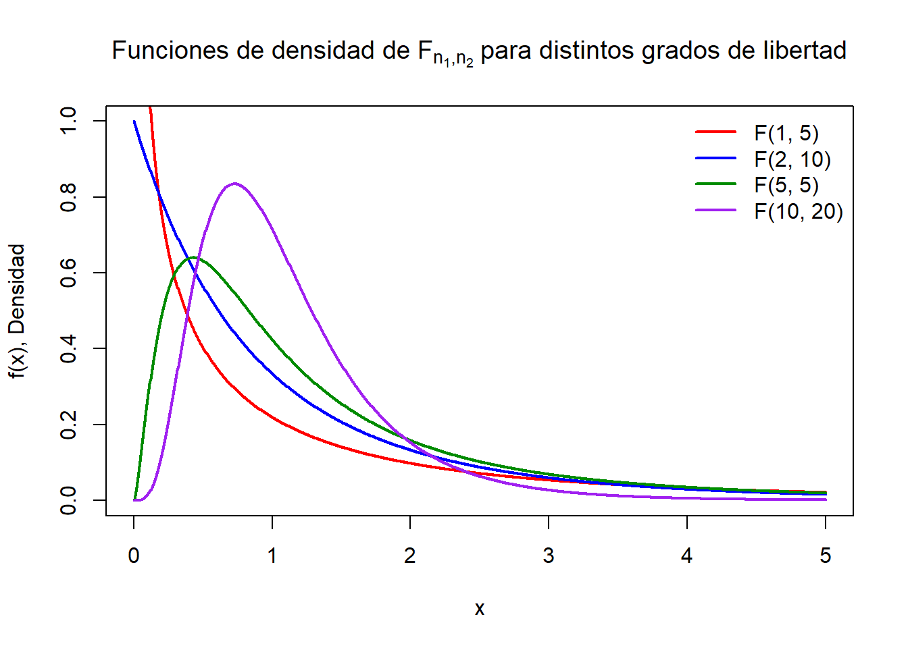

# Modelos de probabilidad continuos {#cont}

En este tema nos centraremos en el estudio de los modelos de probabilidad continuos, es decir, aquellos que describen situaciones en las que las variables aleatorias pueden tomar un número infinito no numerable de valores posibles dentro de un intervalo. Este tipo de modelos es especialmente relevante cuando se analizan fenómenos que varían de forma gradual y continua, como el tiempo, las cantidades económicas o los rendimientos financieros.

Comprender estos modelos es crucial para abordar con éxito muchos problemas prácticos en economía, empresa y finanzas. Por ejemplo, permiten modelizar tiempos de espera, ingresos, tasas de conversión, precios, volúmenes de producción y muchos otros aspectos que se expresan mediante variables continuas. El estudio de sus propiedades, estructuras y aplicaciones nos ofrece una base sólida para interpretar datos reales y tomar decisiones fundamentadas en contextos de incertidumbre.

Este documento desarrolla los casos prácticos de cada distribución continua, incluyendo su teoría, aplicaciones en el ámbito económico-empresarial y ejercicios resueltos tanto manualmente como con el uso de R. El objetivo es proporcionar al alumno una herramienta completa que le permita comprender los fundamentos teóricos de cada modelo y aplicarlos a problemas reales que surgen en el análisis y modelización de datos continuos.

## Distribución uniforme $(U(a, b))$

**Definición**

Una variable aleatoria continua $X$ sigue una **distribución uniforme continua** en el intervalo $[a, b]$, con $a < b$, si su función de densidad de probabilidad es constante en ese intervalo:

$$
X \sim U(a, b)
$$

La **función de desnsidad** es:

$$
f(x) = \begin{cases}
\frac{1}{b - a}, & \text{si } a \le x \le b \\
0, & \text{en otro caso}
\end{cases}
$$

y la **Función de distribución**

$$
F(x) = \begin{cases}
0, & x < a \\
\frac{x - a}{b - a}, & a \le x \le b \\
1, & x > b
\end{cases}
$$

**Momentos**

\- Media: $E(X) = \frac{a + b}{2}$

\- Varianza: $\operatorname{Var}(X) = \frac{(b - a)^2}{12}$

**Aplicaciones**

La distribución uniforme continua se utiliza cuando se considera que todos los valores dentro de un intervalo son igualmente probables. Es adecuada en situaciones como:

-   Tiempo de llegada aleatoria dentro de un intervalo de tiempo (por ejemplo, llegada de un cliente entre las 9:00 y las 10:00).
-   Generación de números aleatorios en simulaciones.
-   Modelización de incertidumbre en parámetros desconocidos dentro de rangos conocidos.

**Representación gráfica**


**Ejemplo:**

Una tienda online recibe cada día un único pedido especial que llega en algún momento entre las 9:00 y las 11:00 de la mañana. El responsable logístico considera que, debido a la falta de patrón histórico, **la hora de llegada de ese pedido puede modelarse como una variable aleatoria con distribución uniforme continua en el intervalo** $[9, 11]$.

Se pide:

1.  ¿Cuál es la probabilidad de que el pedido llegue entre las 9:30 y las 10:15?
2.  Calcular la hora media esperada de llegada y la varianza del tiempo de llegada.

**Solución:**

Sea $X \sim U(9, 11)$, donde $X$ representa la hora (en formato decimal) a la que llega el pedido.

1.  Para calcular $P(9.5 \leq X \leq 10.25)$:

$$
P(9.5 \leq X \leq 10.25) = \frac{10.25 - 9.5}{11 - 9} = \frac{0.75}{2} = 0.375
$$

*Nota didáctica:* Para calcular la probabilidad de que una variable uniforme continua tome un valor dentro de un subintervalo del soporte, se pueden usar dos enfoques equivalentes:

-   El primero se basa en que, para una distribución uniforme continua, la probabilidad de un intervalo dentro del soporte se obtiene dividiendo la longitud del intervalo de interés entre la longitud total del soporte. Es decir: $$
    P(d \leq X \leq c) = \frac{c - d}{b -a} $$

    Esto es posible solo cuando el intervalo $$[c, d] \subseteq [a, b]$$ y es la forma más rápida de resolverlo cuando estás trabajando a mano y no tienes acceso a funciones acumuladas.

-   El segundo se basa en el cáclulo de la diferencia de las funciones de distribución $P(d \leq X \leq c) = F(d)-F(c)$

    2.  La media y la varianza son:

$E(X) = \frac{9 + 11}{2} = 10 \quad \text{(hora media de llegada)}$

$V(X) = \frac{(11 - 9)^2}{12} = \frac{4}{12} = 0.333$

**Interpretación:**

-   Hay una probabilidad del **37.5 %** de que el pedido especial llegue entre las 9:30 y las 10:15.
-   En promedio, se espera que llegue a las 10:00, con una dispersión medida por una varianza de 0.333 (horas cuadradas).

**Ejemplo en R**

Una empresa abre un periodo de recepción de solicitudes de financiación entre el día 10 y el día 20 de un mes. Se considera que la llegada de una solicitud en ese intervalo es completamente aleatoria.

Se desea conocer:

1.  La probabilidad de que una solicitud llegue entre el día 12 y el 15.

2.  La media y la varianza del día de llegada.


```r
a <- 10
b <- 20

# Probabilidad de llegada entre los días 12 y 15
dia_inicio <- 12
dia_fin <- 15
#Calculamos la probabilidad como F(15)-F(12)
probabilidad <- punif(dia_fin, min = a, max = b) - punif(dia_inicio, min = a, max = b)

# Media y varianza
media <- (a + b) / 2
varianza <- (b - a)^2 / 12

probabilidad
```

```
## [1] 0.3
```

```r
media
```

```
## [1] 15
```

## Distribución Normal

La distribución normal es una de las más importantes en la estadística y la probabilidad, tanto por sus propiedades matemáticas como por su relevancia empírica. Su importancia se justifica por varias razones fundamentales:

-   **Aparece naturalmente en muchos fenómenos**: Muchas variables económicas, sociales, biológicas y físicas tienden a distribuirse aproximadamente de forma normal, al menos en situaciones de equilibrio o estabilidad (por ejemplo, los salarios, el rendimiento de carteras diversificadas o los errores de medición).

-   **Teorema Central del Límite**: Este resultado fundamental de la estadística establece que, bajo condiciones generales, la suma (o media) de muchas variables aleatorias independientes tiende a distribuirse normalmente, incluso si las variables originales no siguen una normal. Esto explica por qué la normal aparece de forma tan frecuente en el análisis de datos reales.

-   **Simplicidad analítica**: Tiene una función de densidad suave, continua, simétrica y con una forma conocida (la famosa campana de Gauss), lo que facilita el cálculo de probabilidades, inferencias y simulaciones.

-   **Papel clave en inferencia estadística**: Muchos procedimientos estadísticos clásicos (contrastes de hipótesis, intervalos de confianza, regresión, etc.) se basan en la suposición de normalidad o aproximaciones normales.

-   **Aplicaciones económicas y empresariales**: Se utiliza para modelar el comportamiento de retornos financieros, distribución de ingresos, demanda agregada, tiempos de servicio, entre otros.

En la práctica, es habitual trabajar con dos versiones de la distribución normal:

-   La **distribución normal general** $\mathcal{N}(\mu, \sigma)$ permite modelar directamente fenómenos con una media y una dispersión específicas, como salarios, costes o tiempos de producción.
-   La **distribución normal estándar** $\mathcal{N}(0, 1)$ es una versión simplificada que tiene media 0 y desviación típica 1.

Utilizar la versión estándar es muy útil porque:

-   Permite usar tablas estadísticas universales sin necesidad de calcular integrales para cada caso.
-   Facilita la resolución de ejercicios mediante la técnica de estandarización, transformando cualquier variable normal en una estándar.
-   Hace posible comparar variables normales con diferentes unidades o escalas.

### Distribución Normal $(\mu$ , $\sigma)$. $\mathcal{N}(\mu, \sigma)$

**Definición**

Una variable aleatoria continua $X$ sigue una distribución **normal** $(\mu, \sigma)$ si su función de densidad de probabilidad es:

$$f(x) = \frac{1}{\sigma \sqrt{2\pi}} e^{-\frac{1}{2} \left(\frac{x - \mu}{\sigma}\right)^2}, \quad x \in \mathbb{R} $$

Se denota:

$X \sim \mathcal{N}(\mu, \sigma)$

donde:

-   $\mu \in \mathbb{R}$ es la media (centro de la distribución)

-   $\sigma^2 > 0$ es la varianza (dispersión)

**Caractrerísticas**

-   La curva es simétrica respecto a $\mu$
-   El valor de máxima densidad ocurre en $x = \mu$
-   La función nunca es cero, pero tiende a cero en los extremos
-   La distribución es unimodal

**Momentos**

-   $E(X)= \mu$

-   $V⁡(X) = \sigma^2$

**Representación gráfica**

A continuación, se representa gráficamente la función de densidad de una variable aleatoria con distribución normal $\mathcal{N}(2000, 300^2)$.


**Cambios de Varianza y media en la Normal** Efecto de un **cambio en la varianza**. La siguiente figura muestra cómo afecta el valor de la varianza a la forma de la función de densidad: a mayor varianza, más extendida (aplanada, platicúritca) es la curva; a menor varianza, más concentrada alrededor de la media (leptocúrtica).


Efecto de un **cambio en la media**. La siguiente figura muestra cómo afecta el valor de la media a la localización de la distribución normal, manteniendo constante la varianza. La forma de la curva no cambia, pero su centro se desplaza ha derecha o izquierda en función del valor de la media.


**Propiedad aditiva o reproductiva de la Normal**

La distribución normal es **reproductiva**, lo que significa que la suma de variables aleatorias normales independientes también sigue una distribución normal.

Si:

$$
X_1 \sim \mathcal{N}(\mu_1, \sigma_1), \quad X_2 \sim \mathcal{N}(\mu_2, \sigma_2), \quad X_1 \perp X_2
$$

Entonces:

$$
X_1 + X_2 \sim \mathcal{N}(\mu_1 + \mu_2, \sqrt{\sigma_1^2 + \sigma_2^2})
$$

Es decir:

-   La media de la suma es $\mu_1 + \mu_2$
-   La desviación típica de la suma es $\sqrt{\sigma_1^2 + \sigma_2^2}$

Ejemplo: Si dos departamentos de una empresa tienen ingresos aleatorios independientes modelizados por normales, el ingreso total de la empresa también seguirá una distribución normal. La media del ingreso total será la suma de las medias, y la desviación típica reflejará la incertidumbre combinada de ambas fuentes.

Si se **generaliza** esta propiedad (es decir, si se realiza un cambio en la media y en la varianza), es decir, si se hace una combinación lineal de un conjunto de variables alaeatorias normales la propiedad será:

$$
X_j \sim \mathcal{N}(\mu_j, \sigma_j) \quad \text{para } j = 1, \dots, n
$$

Y una combinación lineal de ellas ($Y$) :

$$
Y = b + \sum_{j=1}^{n} a_j x_j
$$

donde $b \in \mathbb{R}$, $a_j \in \mathbb{R}$, y no todos los $a_j$ son cero. Entonces, $Y$ también sigue una distribución normal con:

$$
\omega \sim \mathcal{N}\left( b + \sum_{j=1}^{n} a_j \mu_j, \; \sqrt{\sum_{j=1}^{n} a_j^2 \sigma_j^2} \right)
$$

**Casos particulares de la propiedad aditivva o reproductiva**

A continuación se presentan algunos casos particulares relevantes de la propiedad aditiva para la distribución normal:

1.  Variables independientes con distinta media y desviación típica

Si $X_i \sim \mathcal{N}(\mu_i, \sigma_i)$ y son independientes, la combinación lineal $Y = \sum_{i =1}^{n} X_i$ entonces:

$$
Y = X_1 + X_2 + \cdots + X_n \sim \mathcal{N}\left( \sum_{i=1}^{n} \mu_i, \; \sqrt{ \sum_{i=1}^{n} \sigma_i^2 } \right)
$$

2\. Variables independientes con misma desviación típica $\sigma$

Si $X_i \sim \mathcal{N}(\mu_i, \sigma)$ y son independientes, la combinación lineal $Y = \sum_{i =1}^{n} X_i$ entonces:

$$
Y \sim \mathcal{N}\left( \sum_{i=1}^{n} \mu_i, \; \sigma \sqrt{n} \right)
$$

3\. Promedio de variables normales independientes con diferente media y desviación típica

Si $X_i \sim \mathcal{N}(\mu_i, \sigma_i)$, independientes, la combinación lineal $Y = \frac{1}{n} \sum_{i=1}^{n} X_i$ entonces:

$$
Y = \frac{1}{n} \sum_{i=1}^{n} X_i \sim \mathcal{N}\left( \frac{1}{n} \sum_{i=1}^{n} \mu_i, \; \sqrt{ \frac{1}{n^2} \sum_{i=1}^{n} \sigma_i^2 } \right)
$$

4\. Promedio de variables normales iid con misma media y desviación típica

Si $X_i \overset{iid}{\sim} \mathcal{N}(\mu, \sigma)$, la combinación lineal $Y = \frac{1}{n} \sum_{i=1}^{n} X_i$ entonces:

$$
Y  \sim \mathcal{N}\left( \mu, \; \frac{\sigma}{\sqrt{n}} \right)
$$

**Estandarización**

Cualquier variable normal $X \sim \mathcal{N}(\mu, \sigma)$ puede transformarse en una **normal estándar** $Z \sim \mathcal{N}(0, 1)$ mediante:

$Z = \frac{X - \mu}{\sigma}$

Esto permite usar tablas de la normal estándar para calcular probabilidades.

**Ejercicio:**\
El salario mensual de los empleados de una empresa sigue una distribución normal con media 2000€ y desviación típica 300€. Sea $X \sim \mathcal{N}(2000, 300)$. Calcular:

1.  La probabilidad de que un empleado cobre menos de 2300€\
2.  La probabilidad de que su salario esté entre 1850€ y 2150€

**Solución:**

Se estandariza:

-   $Z_1 = \frac{2300 - 2000}{300} = 1$

-   $Z_2 = \frac{1850 - 2000}{300} = -0.5$

-   $Z_3 = \frac{2150 - 2000}{300} = 0.5$

Consultando la tabla de la normal estándar:

-   $P(Z < 1) = 0.8413$

-   $P(Z < 0.5) = 0.6915$

-   $P(Z < -0.5) = 0.3085$

En consecuencia

$P(X < 2300) = 0.8413$

$P(1850 < X < 2150) = 0.6915 - 0.3085 = 0.3830$

**Solución con R**


```r
mu <- 2000
sigma <- 300

# a) P(X < 2300)
pnorm(2300, mean = mu, sd = sigma)
```

```
## [1] 0.8413447
```

```r
# b) P(1850 < X < 2150)
pnorm(2150, mean = mu, sd = sigma) - pnorm(1850, mean = mu, sd = sigma)
```

```
## [1] 0.3829249
```

```r
# Media y varianza
media <- mu
varianza <- sigma^2
media
```

```
## [1] 2000
```

```r
varianza
```

```
## [1] 90000
```

**Representación gráfica de las probabilidades**

Visualizamos a continuación las dos situaciones planteadas en el ejemplo: la probabilidad de cobrar menos de 2300€, y la probabilidad de cobrar entre 1850€ y 2150€.


### Distribución Normal Estándar $\mathcal{N}(0, 1)$

**Definición**

La **distribución normal estándar** es un caso particular de la distribución normal general en la que:

$X \sim \mathcal{N}(0, 1)$

Es decir:

-   Tiene **media** $\mu = 0$
-   Tiene **desviación típica** $\sigma = 1$

Su **función de densidad** es:

$f(z) = \frac{1}{\sqrt{2\pi}} e^{-\frac{1}{2}z^2}, \quad z \in \mathbb{R}$

**Propiedades**

-   Es simétrica respecto al origen ($z = 0$)
-   La mayor parte del área bajo la curva se concentra entre $z = -3$ y $z = 3$
-   El valor máximo de la densidad ocurre en $z = 0$
-   Es unimodal y su forma es la famosa "campana de Gauss"

**Importancia de la normal estándar**

-   Permite el cálculo de probabilidades sin necesidad de integrar para cada caso
-   Las tablas de la normal estándar están ampliamente disponibles y permiten resolver problemas de cualquier normal mediante un cambio de variable

Representación gráfica


**Ejemplo:** El tiempo de atención al cliente en un servicio financiero se distribuye como $X \sim \mathcal{N}(15, 2)$. Calcular la probabilidad de que un cliente tarde menos de 17 minutos en ser atendido.

Solución:

$Z = \frac{17 - 15}{2} = 1 \Rightarrow P(X < 17) = P(Z < 1) = 0.8413$

Aproximadamente el 84.13% de los clientes son atendidos en menos de 17 minutos.

**Ejemplo en R**


```r
mu <- 15
sigma <- 2
z <- (17 - mu)/sigma
pnorm(z) # P(Z < 1)
```

```
## [1] 0.8413447
```

**Cálculo de probabilidades directas usando tablas de la normal estándar (N(0, 1))**

Las tablas que utilizamos en este curso proporcionan el valor de la probabilidad acumulada **a la derecha** del valor de $z$, es decir: $P(Z > z)$

Por tanto:

-   $P(Z < z) = 1 - P(Z > z)$
-   $P(Z > z) = \text{valor directo de la tabla}$
-   $P(Z < -z) = P(Z > z)$ (por simetría)
-   $P(|Z| < z) = 1 - 2 \cdot P(Z > z)$

***Cálculo manual con tabla***

Calcular:

1.  $P(Z > 1.25)$
2.  $P(Z < 1.25)$
3.  $P(Z < -1.25)$
4.  $P(|Z| < 1.25)$
5.  $P(Z \geq -1.85)$
6.  $P(0.20 < Z \leq 1.95)$
7.  $P(-1.60 \leq Z \leq -0.45)$

Solución:

A partir de la tabla (observa el dibujo que aprece en R para saber que necesitas calcular):

-   $P(Z > 1.25) = 0.1056$
-   $P(Z \< 1.25) = 1 - P(Z \geq 1.25)=1 - 0.1056 = 0.8944$
-   $P(Z < -1.25) = P(Z > 1.25) = 0.1056$
-   $P(|Z| < 1.25) = 1 - 2 \cdot 0.1056 = 0.7888$
-   $P(Z \geq -1.85) = 1 - P(Z \leq -1.85) = 1 - 0.0322 = 0.9678$
-   $P(0.20 < Z \leq 1.95) = P(Z \geq 0.20) - P(Z \geq 1.95)=0.4207-0.0256=0.3951$
-   $P(-1.60 \leq Z \leq -0.45)= P(Z ≥ 0.45) - P(Z ≥ 1.60)=0.3264-0.0548=0.2716$

Búsqueda en tablas de la distribución normal estándar

La distribución normal estándar se denota como:

$Z \sim \mathcal{N}(0, 1)$

Las tablas que utilizamos en este curso proporcionan el valor de la probabilidad acumulada **a la derecha** del valor de $z$, es decir:

$P(Z > z)$

Por tanto:

-   $P(Z < z) = 1 - P(Z > z)$
-   $P(Z > z) = \text{valor directo de la tabla}$
-   $P(Z < -z) = P(Z > z)$ (por simetría)
-   $P(|Z| < z) = 1 - 2 \cdot P(Z > z)$

***Cálculo de probabilidades con R:***

Nota: Antes de nada, las fórmulas de R caclulan por defecto las probabilidades acumuladas (es decir, desde el punto que se busca e inferiores a el `lower.tail=TRUE`). Sin embargo, las tablas impresas que empleamos están construidas hacia la derecha.

1.  Calcular $P(Z > 1.25)$


```r
pnorm(1.25, lower.tail = FALSE)
```

```
## [1] 0.1056498
```

Representación gráfica:


2.  Calcular $P(Z < 1.25)$


```r
pnorm(1.25)
```

```
## [1] 0.8943502
```

Representación gráfica:


3.  Calcular $P(Z < -1.25)$


```r
pnorm(-1.25)
```

```
## [1] 0.1056498
```

Representación gráfica:


4.  Calcular $P(|Z| < 1.25)$


```r
1 - 2 * pnorm(1.25, lower.tail = FALSE)
```

```
## [1] 0.7887005
```

Representación gráfica:


5.  Calcular $P(Z \geq -1.85)$


```r
z<- -1.85
pnorm(z, lower.tail = FALSE)
```

```
## [1] 0.9678432
```

$$
P(Z \geq -1.85) = 1 - P(Z \leq -1.85) = 1 - 0.0322 = 0.9678
$$

Representación gráfica


```
## [1] 0.9678432
```


6.  $P(0.20 < Z \leq 1,95)$

Calculamos:
$$
P(0.20 < Z \leq 1.95) = P(Z \geq 0.20) - P(Z \geq 1.95)
$$


```r
a <- 0.20
b <- 1.95

# Cálculo de la probabilidad
prob <- pnorm(a, lower.tail = FALSE) - pnorm(b, lower.tail = FALSE)
prob
```

```
## [1] 0.3951522
```

Representación gráfica


7.  $P(-1.60 \leq Z \leq -0.45)$


```r
a2 <- -1.60
b2 <- -0.45

# Cálculo usando simetría: P(Z ≥ 0.45) - P(Z ≥ 1.60)
prob2 <- pnorm(-a2, lower.tail = FALSE) - pnorm(-b2, lower.tail = FALSE)
prob2 
```

```
## [1] -0.2715559
```

Representación gráfica



**Cálculo de probabilidad inversa de la Normal Estándar**

De la misma forma que hemos calculado una serie de valores de probabilidades normales, cuando conocemos el suceso podemos encontrarnos en la situación inversa, es decir, conocida la probabilidad, hallar el valor de la abscisa.

En estos casos es necesario, en la mayoría de las tablas de la distribución $\mathcal{N}(0,1)$, determinar el **signo de la abscisa**, como se indica en el siguiente cuadro:

<table class="table table-striped table-hover" style="width: auto !important; margin-left: auto; margin-right: auto;">
 <thead>
  <tr>
   <th style="text-align:center;"> Suceso </th>
   <th style="text-align:center;"> &gt; 0,5 </th>
   <th style="text-align:center;"> &lt; 0,5 </th>
   <th style="text-align:center;"> = 0,5 </th>
  </tr>
 </thead>
<tbody>
  <tr>
   <td style="text-align:center;"> $Z \geq a$ </td>
   <td style="text-align:center;"> Negativa </td>
   <td style="text-align:center;"> Positiva </td>
   <td style="text-align:center;"> 0 </td>
  </tr>
  <tr>
   <td style="text-align:center;"> $Z \leq a$ </td>
   <td style="text-align:center;"> Positiva </td>
   <td style="text-align:center;"> Negativa </td>
   <td style="text-align:center;"> 0 </td>
  </tr>
</tbody>
</table>

***Ejemplos***

-   1\. $P(Z \geq a) = 0.35$

Como $P(Z \geq a) = 0.35$, se cumple que:

$$
P(Z \leq a) = 1 - 0.35 = 0.65
$$

Buscamos el valor de $a$ tal que $P(Z \leq a) = 0.65$.


```r
# Inversa de la normal estándar
p <- 0.65
a <- qnorm(p)
a  # Resultado ≈ 0.385
```

```
## [1] 0.3853205
```

En este caso $a$ es positivo.

-   2\. $P(Z \geq a) = 0.65$

Como $P(Z \geq a) = 0.65$, se cumple que:

$$
P(Z \leq a) = 1 - 0.65 = 0.35
$$

Buscamos el valor de $a$ tal que $P(Z \leq a) = 0.35$.


```r
p <- 0.35
a <- qnorm(p)
a  # Resultado ≈ -0.385
```

```
## [1] -0.3853205
```

En este caso $a$ es negativo

-   3\. $P(Z \leq a) = 0.65$

Buscamos directamente el valor de $a$ tal que:

$$
P(Z \leq a) = 0.65
$$


```r
p <- 0.65
a <- qnorm(p)
a  # Resultado ≈ 0.385
```

```
## [1] 0.3853205
```

En este caso $a$ es positivo.

-   4\. $P(Z \leq a) = 0.35$

Buscamos directamente el valor de $a$ tal que:

$$
P(Z \leq a) = 0.35
$$


```r
p <- 0.35
a <- qnorm(p)
a  # Resultado ≈ -0.385
```

```
## [1] -0.3853205
```

En este caso $a$ es negativo.

## Distribuciones derivadas de la Normal

En muchas aplicaciones estadísticas no trabajamos directamente con variables que siguen una distribución normal, sino con funciones de variables normales. Estas funciones dan lugar a nuevas distribuciones conocidas como **distribuciones derivadas de la normal**.

Las más importantes son:

-   La **distribución ji-cuadrado** ($\chi^2$), que aparece al elevar al cuadrado variables normales estándar.
-   La **distribución t de Student**, que surge al estudiar la media muestral cuando la varianza poblacional es desconocida.
-   La **distribución F de Snedecor**, que se utiliza al comparar dos varianzas.

Estas distribuciones desempeñan un papel fundamental en la **estadística inferencial**, ya que permiten realizar estimaciones y contrastes de hipótesis sobre medias y varianzas, incluso cuando no se conoce toda la información poblacional.

A continuación, estudiaremos cada una de estas distribuciones, su definición, propiedades, y cómo se relacionan con la distribución normal.

### Distribución ji-cuadrado $(\chi^2)$

La **distribución chi-cuadrado** ($\chi^2$) es una distribución continua que aparece de forma natural cuando se eleva al cuadrado una variable normal estándar o se suman los cuadrados de varias variables normales estándar independientes.

**Definición**

Una variable aleatoria $Z \sim \mathcal{N}(0,1)$ al ser elevada al cuadrado sigue una distribución $\chi^2$ con 1 grado de libertad:

$$
Z^2 \sim \chi^2_1
$$

Más generalmente, si $Z_1, Z_2, \dots, Z_n$ son variables normales estándar independientes:

$$
\chi^2_k = Z_1^2 + Z_2^2 + \dots + Z_n^2
$$

Entonces decimos que $\chi^2_k$ sigue una distribución chi-cuadrado con $n$ grados de libertad.

**Función de densidad de la distribución** $\chi^2_n$

La función de densidad de una variable aleatoria que sigue una distribución $\chi^2_n$ con $n$ grados de libertad es:

$$
f(x, n) = \frac{1}{2^{n/2} \, \Gamma(n/2)} \, x^{(n/2 - 1)} \, e^{-x/2}, \quad x > 0
$$

donde $\Gamma(\cdot)$ es la función gamma.

La forma de su función de densidad depende de los grados de libertad de la distribución, aunque su presentación gráfica es una distribución asimétrica positiva bastante pronunciada.


**Propiedades básicas**

-   **Soporte**: $x \in [0, \infty)$
-   **Media**: $E(\chi^2_n) = n$
-   **Varianza**: $V(\chi^2_n) = 2n$
-   Es una distribución **asimétrica positiva**, aunque **se aproxima a la normal** a medida que aumentan los grados de libertad.

**Aplicaciones**

La distribución $\chi^2$ ocupa un lugar central en la estadística inferencial, ya que permite realizar contrastes de hipótesis y evaluar la variabilidad en distintos contextos. Su importancia va más allá de la teoría: en economía y en las ciencias sociales, se utiliza de forma habitual para validar modelos, analizar relaciones entre variables y verificar supuestos estadísticos clave. Entender la distribución $\chi^2$ y sus aplicaciones es esencial para interpretar correctamente los resultados de numerosos análisis cuantitativos en el ámbito económico.

Algunas de sus aplicaciones clave son:

-   Base para la construcción de la distribución **t de Student** y **F de Snedecor**. La distribución $\chi^2$ para construir dos de las distribuciones más importantes derivadas de la Normal.

-   **Contrastes de independencia**: en análisis de datos categóricos, se utiliza la $\chi^2$ para contrastar si dos variables (por ejemplo, nivel educativo y tipo de empleo) son independientes.

-   **Contrastes de bondad de ajuste**: permite evaluar si los datos observados siguen una determinada distribución teórica, útil en estudios de ingresos, gasto, precios, etc.

-   **Contrastes de varianzas**: en estudios de riesgo o volatilidad (por ejemplo, en finanzas), se emplea la $\chi^2$ para verificar si la variabilidad observada es compatible con ciertos supuestos.

-   **Modelización econométrica**: en pruebas de especificación o de homocedasticidad (como la prueba de Breusch-Pagan), la distribución $\chi^2$ aparece como distribución de referencia para contrastes.

-   **Análisis multivariante**: en modelos como el análisis factorial o la estimación por máxima verosimilitud, se utilizan contrastes basados en la $\chi^2$ para evaluar la adecuación del modelo a los datos.

**Manejo de tablas**

Para el cálculo de probabilidades asociadas a la distribución $\chi^2$, es habitual recurrir a **tablas estadísticas** que proporcionan valores aproximados, del mismo modo que ocurre con la distribución normal $\mathcal{N}(0,1)$.

Estas tablas suelen proporcionar valores de la **probabilidad del suceso**:

$$
P(\chi_n^2 \geq a)
$$

Es decir, dan el área bajo la curva situada **a la derecha del valor** $a$.

A diferencia de la distribución normal, la distribución $\chi^2$, no es simétrica y no admite valores negativos.

**Interpretación gráfica**

A continuación se representa el área sombreada que corresponde a $P(\chi^2(n) \geq a)$:


**Ejemplo de búsqueda en tablas**

1.  *Cálculo de una probabilidad directa*

Queremos calcular:

$$
P(3.94 \leq \chi_{10}^2 \leq 15.987)
$$

Utilizando la tabla:

-   $P(\chi_{10}^2 \geq 3.94) = 0.95$
-   $P(\chi_{10}^2 \geq 15.987) = 0.05$

Por tanto:

$$
P(3.94 \leq \chi_{10}^2 \leq 15.987) = F(3.94)-F(15.987)= 0.95 - 0.05 = 0.90
$$

2.  *Cálculo de probabilidad inversa (calculo de la probabilidad a partir de un valor)*

Sabemos que:

$$
P(8.231 \leq \chi_{19}^2 \leq a) = 0.725
$$

Entonces:

-   $P(\chi_{19}^2 \geq 8.231) = 0.95$
-   Necesitamos encontrar $a$ tal que $P(\chi_{19}^2 \geq a) = 0.225$

Buscando en la tabla para $\chi_{19}^2$, encontramos:

$$
a \approx 12.338
$$

**Ejemplos de cálculo de probabilidades con R**

\- Probabilidad directa con `pchisq`

Queremos calcular:

$$
P(\chi_{12}^2 \leq 18.55)
$$


```r
# Probabilidad acumulada a la izquierda
p <- pchisq(18.55, df = 12)
p  # Resultado ≈ 0.8986
```

```
## [1] 0.9000175
```

Búsqueda dprobabilidad inversa con `qchisq`

Queremos encontrar el valor $a$ tal que:

$$
P(\chi_{15}^2 \geq a) = 0.10
$$

Es decir, buscamos el percentil que deja un 10% de probabilidad a la derecha.


```r
# Valor crítico tal que P(chi² ≥ a) = 0.10 → cola derecha
a <- qchisq(0.90, df = 15)  # usamos 0.90 porque calcula P(X ≤ a)
a  # Resultado ≈ 22.307
```

```
## [1] 22.30713
```

### Distribución t de Student $(t_n)$

La **distribución t de Student** es una distribución continua que surge de forma natural cuando se trabaja con muestras pequeñas de una población normal, especialmente cuando la varianza poblacional es desconocida.

**Definición**

Si $Z \sim \mathcal{N}(0,1)$ y $U \sim \chi^2_n$, con $Z$ y $U$ independientes, entonces la variable:

$$
T = \frac{Z}{\sqrt{U/n}} \sim t_n
$$

sigue una distribución t de Student con $n$ grados de libertad.

**Función de densidad de la distribución** $t_n$

La función de densidad de la distribución t de Student con $n$ grados de libertad es:

$$
f(x, n) = \frac{\Gamma\left( \frac{n+1}{2} \right)}{\sqrt{n\pi} \, \Gamma\left( \frac{n}{2} \right)} \left(1 + \frac{x^2}{n} \right)^{-\frac{n+1}{2}}, \quad x \in \mathbb{R}
$$

donde $\Gamma(\cdot)$ es la función gamma.

Esta distribución tiene **cola más pesada** que la normal, y tiende a la normal estándar conforme aumentan los grados de libertad.


**Propiedades básicas**

-   **Soporte**: $x \in (-\infty, \infty)$
-   **Media**: $E(t_n) = 0$ si $n > 1$
-   **Varianza**: $V(t_n) = \frac{n}{n-2}$ si $n > 2$
-   Tiene una forma similar a la normal, pero con colas más pesadas (mayor probabilidad en los extremos).
-   A medida que $n \to \infty$, $t_n \to \mathcal{N}(0,1)$

**Aplicaciones**

La distribución t de Student es fundamental en estadística inferencial y análisis económico, especialmente cuando trabajamos con muestras pequeñas y no conocemos la varianza poblacional. Algunas de sus aplicaciones clave son:

-   Estimación y contrastes de hipótesis para **medias** con varianza desconocida.
-   Construcción de **intervalos de confianza** en econometría y análisis financiero.
-   Aplicaciones en **tests de regresión** (por ejemplo, para contrastar si un coeficiente es significativamente distinto de cero).
-   Evaluación de resultados experimentales o de encuestas en economía con tamaños muestrales limitados.

**Manejo de tablas**

Las tablas de la t de Student proporcionan valores críticos $a$ tales que:

$$
P(T_n \geq a) \quad \text{o} \quad P(|T_n| \geq a)
$$

Dado que la t es **simétrica respecto a 0**, se pueden obtener valores de colas unilaterales y bilaterales. A diferencia de la $\chi^2$, admite valores negativos y positivos, y su interpretación es muy parecida a la de la normal estándar.

**Ejemplo gráfico**

Se muestra el área a la derecha de un valor $a$ para la t de Student con n grados de libertad:


**Ejemplos de búsqueda en tablas**

1.  *Búsqueda directa de una probabilidad*

Sea $T \sim t_{12}$. Calcula $P(T \geq 1.782)$.

Resolución:

1.  Consultamos la tabla t para $n = 12$ y buscamos el valor $t = 1.782$.
2.  En las tablas t de cola derecha, encontramos que:

$$
P(T \geq 1.782) = 0.05
$$

La probabilidad de que $T$ tome un valor mayor o igual que 1.782 es 0.05.

2.  *Búsqueda inversa de un valor crítico*

Sea $T \sim t_{15}$. ¿Qué valor de $t$ cumple que $P(T \geq t) = 0.10$?

Resolución:

1.  Buscamos en la tabla t, en la fila correspondiente a $n = 15$ y la columna de probabilidad 0.10 (cola derecha).
2.  Encontramos:

$$
t = 1.341
$$

El valor crítico que deja una probabilidad de 0.10 a la derecha en una t de Student con 15 grados de libertad es $t = 1.341$.

3.  *Probabilidad bilateral centrada en 0*

Sea $T \sim t_{10}$. Calcula $P(-2.228 \leq T \leq 2.228)$.

Resolución:

1.  Dado que la distribución t es simétrica, tenemos:

$$
P(-2.228 \leq T \leq 2.228) = 1 - 2 \cdot P(T \geq 2.228)
$$

2.  En la tabla, para $n = 10$ y $t = 2.228$, encontramos:

$$
P(T \geq 2.228) = 0.025
$$

3.  Por tanto:

$$
P(-2.228 \leq T \leq 2.228) = 1 - 2 \cdot 0.025 = 0.95
$$

El 95% de la distribución t con 10 grados de libertad se encuentra entre -2.228 y 2.228.

**Ejemplos de cálculo de probabilidades con R**

*Probabilidad directa con `pt`*

Queremos calcular:

$$
P(T_{12} \leq 1.782)
$$


```r
# Probabilidad acumulada a la izquierda
p <- pt(1.782, df = 12)
p  # Resultado ≈ 0.9499
```

```
## [1] 0.9499756
```

***Probabilidad inversa con `qt`***

Queremos encontrar el valor $a$ tal que:

$$
P(T_{15} \geq a) = 0.10
$$

Es decir, buscamos el percentil que deja un 10% de probabilidad a la derecha.


```r
# Valor crítico tal que P(t ≥ a) = 0.10
a <- qt(0.90, df = 15)  # usamos 0.90 porque qt calcula P(t ≤ a)
a  # Resultado ≈ 1.3406
```

```
## [1] 1.340606
```

### Distribución F de Snedecor $(F{n_1,n_2})$

La **distribución F de Snedecor** es una distribución continua que surge al comparar dos varianzas muestrales provenientes de poblaciones normales. Es fundamental en el análisis de la varianza (ANOVA) y en contrastes de hipótesis sobre varianzas.

**Definición**

Si $U_1 \sim \chi^2_{n_1}$ y $U_2 \sim \chi^2_{n_2}$, independientes, entonces la variable:

$$
F = \frac{U_1 / n_1}{U_2 / n_2} \sim F_{n_1, n_2}
$$

sigue una distribución F con $n_1$ y $n_2$ grados de libertad en el numerador y denominador, respectivamente.

**Función de densidad de la distribución** $F_{n_1, n_2}$

La función de densidad de la distribución F con $n_1$ grados de libertad en el numerador y $n_2$ en el denominador es:

$$
f(x) = \frac{\left(\frac{n_1}{n_2}\right)^{n_1/2} \Gamma\left(\frac{n_1 + n_2}{2}\right)}{\Gamma\left(\frac{n_1}{2}\right) \Gamma\left(\frac{n_2}{2}\right)} \cdot x^{(n_1/2 - 1)} \cdot \left(1 + \frac{n_1}{n_2}x\right)^{-\frac{n_1 + n_2}{2}}, \quad x > 0
$$

donde $\Gamma(\cdot)$ es la función gamma.



**Propiedades básicas**

-   **Soporte**: $x \in (0, \infty)$
-   **Media**: $E(F_{n_1, n_2}) = \frac{n_2}{n_2 - 2}$, si $n_2 > 2$
-   **Varianza**: más compleja, pero decrece al aumentar los grados de libertad.
-   Es una distribución **asimétrica positiva**.
-   A medida que $n_1$ y $n_2$ aumentan, la distribución F se aproxima a una distribución normal.

**Aplicaciones**

La distribución F es especialmente útil en:

-   **Contrastes de varianzas**: comparar la variabilidad entre dos poblaciones.
-   **Análisis de la varianza (ANOVA)**: comparar medias de varios grupos.
-   **Contrastes sobre modelos de regresión**: evaluar si un modelo explica significativamente la variable dependiente.
-   **Econometría**: pruebas globales de significatividad en modelos lineales.

**Manejo de tablas**

Las tablas de la F de Snedecor suelen proporcionar valores críticos $x$ tales que:

$$
P(F_{n_1, n_2} \geq x)
$$

Es decir, indican el valor de $x$ a partir del cual queda una cierta probabilidad a la derecha (cola superior). Como la distribución F **no es simétrica** ni admite valores negativos, siempre se calcula el área bajo la cola derecha.

**Ejemplo gráfico**

Se muestra el área a la derecha de un valor $x$ en una distribución $F_{n_1, n_2}$:


**Cálculo de probabilidades usando tablas**

Las tablas de la distribución F de Snedecor suelen mostrar **valores críticos** $x$ tales que:

$$
P(F_{n_1, n_2} \geq x) = \alpha
$$

         
1.  *Búsqueda directa de una probabilidad*


Sea $F \sim F_{5, 10}$. Calcula $P(F \geq 3.33)$.

Resolución:

1.  Consultamos la tabla F en la fila correspondiente a $n_1 = 5$ y la columna $n_2 = 10$.
2.  En muchas tablas aparece que:

$$
F_{5, 10}(0.05) = 3.33
$$

Esto indica que:

$$
P(F \geq 3.33) = 0.05
$$

La probabilidad de que $F$ tome un valor mayor o igual a 3.33 es 0.05.

2.  *Búsqueda inversa de un valor crítico*

Sea $F \sim F_{8, 12}$. ¿Qué valor $x$ cumple que $P(F \geq x) = 0.01$?

Resolución:

1.  Buscamos en la tabla F en la fila de $n_1 = 8$ y columna $n_2 = 12$, en el nivel $\alpha = 0.01$.
2.  Encontramos:

$$
F_{8, 12}(0.01) = 5.40
$$

El valor crítico que deja un 1% de probabilidad a la derecha es $x = 5.40$.

**Ejemplos de cálculo de probabilidades con R**

*- Probabilidad directa con `pf`*

Queremos calcular:

$$
P(F_{5, 10} \leq 3.33)
$$


```r
# Probabilidad acumulada a la izquierda
p <- pf(3.33, df1 = 5, df2 = 10)
p  # Resultado ≈ 0.9502
```

```
## [1] 0.9501687
```

*- Probabilidad inversa con `qf`*

Queremos encontrar el valor $x$ tal que:

$$P(F_{8, 12} \geq x) = 0.05$$

Es decir, buscamos el percentil que deja un 5% de probabilidad a la derecha.


```r
# Valor crítico tal que P(F ≥ x) = 0.05
x <- qf(0.95, df1 = 8, df2 = 12)  # usamos 0.95 porque qf calcula P(F ≤ x)
x  # Resultado ≈ 2.9012
```

```
## [1] 2.848565
```

### Aplicaciones a las Ciencias Sociales de las distribuciones derivadas de la Normal

**Distribución** $\chi^2$

-   **Evaluación del perfil del consumidor**: mediante tablas de contingencia y pruebas de independencia (basadas en $\chi^2$), se puede estudiar si variables como el género y la preferencia por un producto están relacionadas.

-   **Análisis de resultados electorales**: se puede contrastar si la distribución de votos difiere de lo esperado por azar entre distintas regiones o franjas de edad.

-   **Control de calidad**: en la industria, la $\chi^2$ se usa para comprobar si la variabilidad de los procesos se mantiene dentro de lo permitido por la normativa.

**Distribución t de Student**

-   **Estudios de mercado con muestras pequeñas**: al analizar encuestas piloto sobre precios, demanda o satisfacción de clientes, se utiliza la t para estimar medias o realizar contrastes sin conocer la varianza poblacional.

-   **Evaluación de impacto económico local**: en proyectos de desarrollo o inversión, si se toman muestras pequeñas (por ejemplo, ventas antes y después de una intervención), la t permite estimar si el cambio es significativo.

-   **Detección de fraude o manipulación**: al comparar medias de ingresos o gastos entre grupos (empresas, municipios), se puede detectar comportamientos anómalos mediante contrastes t.

**Distribución F de Snedecor**

-   **Comparación de modelos económicos**: en econometría, la F se utiliza para comparar modelos de regresión (por ejemplo, uno restringido y uno general) y decidir si añadir nuevas variables mejora significativamente la explicación.

-   **Análisis del rendimiento académico**: si se quiere saber si las medias de distintas titulaciones universitarias (o facultades) difieren entre sí, se aplica ANOVA, que se basa en la F.

-   **Estudios sobre desigualdad**: en análisis territorial, se puede utilizar la F para estudiar si la variabilidad en el nivel de renta entre regiones es significativamente distinta de la variabilidad dentro de cada región.

<table class="table table-striped table-hover" style="width: auto !important; margin-left: auto; margin-right: auto;">
 <thead>
  <tr>
   <th style="text-align:center;"> Distribución </th>
   <th style="text-align:center;"> Aplicaciones en Ciencias Sociales </th>
  </tr>
 </thead>
<tbody>
  <tr>
   <td style="text-align:center;"> $$\chi^2$$ </td>
   <td style="text-align:center;"> • Pruebas de independencia (datos categóricos)<br>• Contrastes de bondad de ajuste<br>• Control de calidad<br>• Validación de modelos en economía y sociología </td>
  </tr>
  <tr>
   <td style="text-align:center;"> $$t_n$$ </td>
   <td style="text-align:center;"> • Estimación y contraste de medias con muestras pequeñas<br>• Análisis de impacto en encuestas piloto<br>• Evaluación de intervenciones económicas<br>• Detección de anomalías o fraude </td>
  </tr>
  <tr>
   <td style="text-align:center;"> $$F_{n_1,n_2}$$ </td>
   <td style="text-align:center;"> • Comparación de modelos en regresión<br>• Análisis de la varianza (ANOVA)<br>• Estudios regionales de desigualdad<br>• Contrastes globales de significatividad </td>
  </tr>
</tbody>
</table>

## Distribución Exponencial $(Exp(\lambda))$

La distribución **exponencial** es un caso particular de la distribución Gamma, y se utiliza frecuentemente para modelar el **tiempo entre eventos** en un proceso aleatorio que ocurre a una tasa constante, como llegadas de clientes, fallos de sistemas o accidentes.

**Definición**

Una variable aleatoria $X$ tiene una distribución **exponencial** de parámetro $\lambda > 0$ $X \sim Exp(\lambda)$ si su función de densidad es:

$$
f(x; \lambda) = \lambda e^{-\lambda x}, \quad x > 0
$$

**Función de distribución**

La función de distribución acumulada es:

$$
F(x) = P(X \leq x) = 1 - e^{-\lambda x}, \quad x > 0
$$

Por tanto, la probabilidad de que el evento **aún no haya ocurrido antes de tiempo** $x$ es:

$$
P(X > x) = e^{-\lambda x}
$$

**Relación con la distribución Gamma**

La distribución exponencial es un caso particular de la distribución Gamma:

$$
\text{Exponencial}(\lambda) \equiv \text{Gamma}(\alpha = 1, \beta = 1/\lambda)
$$

**Propiedades**

-   **Soporte**: $x \in (0, \infty)$
-   **Media**: $E(X) = \frac{1}{\lambda}$
-   **Varianza**: $V(X) = \frac{1}{\lambda^2}$
-   **Asimétrica positiva**, con una larga cola hacia la derecha.
-   Cumple la **propiedad de falta de memoria**:

$$
P(X > s + t \mid X > s) = P(X > t)
$$

Esta propiedad significa que el tiempo esperado restante **no depende del tiempo ya transcurrido**.

**Función de densidad para distintos valores de** $\lambda$


**Aplicaciones**

La distribución exponencial es una de las más utilizadas en estadística aplicada debido a su simplicidad y a que describe adecuadamente fenómenos donde interesa medir el **tiempo hasta que ocurre un evento**.

Algunas de sus aplicaciones más relevantes son:

-   **Modelado del tiempo entre eventos en procesos de Poisson**: En procesos en los que los eventos ocurren de forma aleatoria pero a una tasa constante (por ejemplo, llamadas a un call center, llegadas de clientes a un establecimiento o fallos de una máquina), el tiempo entre dos eventos consecutivos sigue una distribución exponencial. Esto permite simular, prever y gestionar recursos en sistemas de atención, logística o producción.

-   **Análisis de supervivencia**: En estudios médicos y de ingeniería, se utiliza para modelar el tiempo hasta que ocurre un evento como la muerte, una recaída, o el fallo de un componente. Aunque la exponencial es un caso particular dentro del análisis de supervivencia, sirve como modelo base cuando el **riesgo es constante** a lo largo del tiempo.

-   **Economía y finanzas**: La exponencial permite modelar el tiempo entre:

    -   operaciones bursátiles o transacciones bancarias,
    -   impagos de clientes,
    -   reclamaciones de seguros,
    -   cambios de régimen en modelos de series temporales.

    Su facilidad de interpretación la hace útil también como aproximación inicial en estudios de fiabilidad o de riesgo.

-   **Procesos industriales y mantenimiento**: En entornos industriales, se usa para estimar la duración media de una máquina antes de que falle. Esto permite optimizar el mantenimiento preventivo. Si los fallos ocurren al azar y con una tasa constante, entonces el tiempo hasta el fallo sigue una distribución exponencial.

**Ejemplos de cálculo con R**

*- 1: Cálculo de la Probabilidad directa*

Sea $X \sim \text{Exponencial}(0.25)$, calcular $P(X \leq 5)$, es decir, la probabilidad de que el evento ocurra antes de 5 unidades de tiempo:


```r
p <- pexp(5, rate = 0.25)
p  # Resultado ≈ 0.7135
```

```
## [1] 0.7134952
```

*- 2: Cálculo de la Probabilidad inversa*

Queremos encontrar el valor $x$ tal que:

$$
P(X \geq x) = 0.1, \quad X \sim \text{Exponencial}(\lambda = 0.5)
$$

Dado que la función `qexp()` calcula la probabilidad acumulada a la izquierda $P(X \leq x)$, necesitamos encontrar el cuantil correspondiente al 90%:

$$
P(X \geq x) = 0.1 \quad \Rightarrow \quad P(X \leq x) = 0.9
$$


```r
# Valor crítico correspondiente al percentil 90
x <- qexp(0.9, rate = 0.5)
x  # Resultado ≈ 4.605
```

```
## [1] 4.60517
```

## Distribución Gamma $(\Gamma(\alpha))$

La **distribución Gamma** es una distribución continua que generaliza la distribución $\chi^2$ y se utiliza en contextos donde modelamos tiempos de espera, vida útil de productos o fenómenos con tasas constantes.

La función gamma se define mediante la siguiente integral:

$$
\Gamma(p) = \int_0^{\infty} x^{p - 1} e^{-x} \, dx \quad \text{si } x > 0 \text{ y } p > 0.
$$

**Definición**

Una variable aleatoria $X$ sigue una distribución Gamma de parámetros $\alpha > 0$ (parámetro de forma) y $\beta > 0$ (parámetro de escala) $X \sim Ga(\alpha, \beta)$ si su función de densidad es:

$$
f(x; \alpha, \beta) = \frac{1}{\Gamma(\alpha) \beta^\alpha} \, x^{\alpha - 1} e^{-x / \beta}, \quad x > 0
$$

donde $\Gamma(\alpha)$ es la función gamma.

**Función de densidad para diferentes valores de** $\alpha$


**Propiedades básicas**

-   **Soporte**: $x \in (0, \infty)$
-   **Media**: $E(X) = \alpha \beta$
-   **Varianza**: $V(X) = \alpha \beta^2$
-   Si $\alpha = n/2$, $\beta = 2$ → $X \sim \chi^2_n$
-   Para $\alpha = 1$, se convierte en una **distribución exponencial**.

**Aplicaciones**

-   Modelización de **tiempos de espera** hasta la ocurrencia de un evento (por ejemplo, averías, llegadas de clientes).
-   Análisis de la **vida útil de productos o componentes**.
-   En **seguros**, para modelar el importe de reclamaciones agregadas.
-   En **hidrología**, para modelar el volumen de lluvias extremas.
-   En **teoría de colas y procesos de Poisson**, al estudiar el tiempo hasta el $\alpha$-ésimo evento.

**Ejemplos de cálculo de probabilidades con R**

Pasamos directamente al cálculo en R porque las probabilidades de esta distribución no suele buscarse con tablas estadísticas.

*- 1. Probabilidad directa con `pgamma`*

Queremos calcular:

$$
P(X \leq 6), \quad X \sim \text{Gamma}(\alpha = 3, \beta = 2)
$$


```r
p <- pgamma(6, shape = 3, scale = 2)
p  # Resultado ≈ 0.5768
```

```
## [1] 0.5768099
```

*- 2. Valor crítico (probabilidad inversa) con `qgamma`*

Queremos encontrar el valor $x$ tal que:

$$
P(X \geq x) = 0.05, \quad X \sim \text{Gamma}(\alpha = 3, \beta = 2)
$$

Dado que la función `qgamma` calcula la probabilidad acumulada a la izquierda $P(X \leq x)$, buscamos:

$$
P(X \leq x) = 0.95
$$


```r
# Valor crítico para una cola derecha del 5%
x <- qgamma(0.95, shape = 3, scale = 2)
x  # Resultado ≈ 9.4877
```

```
## [1] 12.59159
```

## Distribución Beta $(\mathsf{Beta}(\alpha, \beta))$

La distribución **Beta** es una distribución continua definida en el intervalo $[0,1]$ y muy versátil, especialmente útil en estadística bayesiana, teoría de la probabilidad y simulación. Es una generalización de la distribución uniforme sobre $[0,1]$.

La **función beta** se define mediante la siguiente integral:

$$
B(\alpha, \beta) = \int_0^1 x^{\alpha - 1}(1 - x)^{\beta - 1} \, dx = \frac{\Gamma(\alpha)\Gamma(\beta)}{\Gamma(\alpha + \beta)}
$$

donde $\Gamma(\cdot)$ es la función gamma, y se requiere que $\alpha > 0$, $\beta > 0$.

**Distribución beta**

Una variable aleatoria $X$ tiene una **distribución beta** con parámetros $\alpha > 0$ y $\beta > 0$ si su función de densidad es:

$$
f(x) =
\begin{cases}
\displaystyle \frac{1}{B(\alpha, \beta)} x^{\alpha - 1}(1 - x)^{\beta - 1}, & 0 < x < 1 \\
0, & \text{en otro caso}
\end{cases}
$$

Esta distribución está acotada en el intervalo $(0,1)$, y su forma depende fuertemente de los valores de los parámetros.

> Nota: Cuando $\alpha = 1$ y $\beta = 1$, se obtiene la distribución **uniforme** sobre el intervalo $[0,1]$.

**Propiedades básicas**

-   **Soporte**: $x \in (0, 1)$
-   **Media**: $\mathbb{E}[X] = \frac{\alpha}{\alpha + \beta}$
-   **Varianza**: $\text{Var}(X) = \frac{\alpha \beta}{(\alpha + \beta)^2(\alpha + \beta + 1)}$
-   La forma de la densidad depende de la relación entre $\alpha$ y $\beta$:
    -   Si $\alpha = \beta = 1$, la distribución es **uniforme**.
    -   Si $\alpha > 1$ y $\beta > 1$, tiene forma de campana (simétrica o asimétrica).
    -   Si $\alpha < 1$ o $\beta < 1$, puede presentar **asimetría o forma en U**.
-   Es una distribución útil para **modelar proporciones o probabilidades**.

**Representación gráfica**


**Aplicaciones**

La distribución beta es especialmente útil para modelar variables continuas que **toman valores en el intervalo [0, 1]**, como **proporciones, porcentajes o probabilidades**. Gracias a la flexibilidad que permiten sus dos parámetros $\alpha$ y $\beta$, puede adoptar formas simétricas, asimétricas, en U o en forma de campana, adaptándose a distintos tipos de datos.

A continuación, se detallan algunas aplicaciones relevantes:

***- Estadística bayesiana:*** La beta es la distribución **a priori conjugada** de la binomial. Esto significa que, cuando se utiliza una beta para modelar la probabilidad desconocida de éxito en un experimento binomial, la distribución posterior también será una beta. Esto facilita los cálculos y la interpretación.

***- Análisis de proporciones en ciencias sociales:*** En estudios de encuestas o demografía, las respuestas pueden ser proporciones: porcentaje de ciudadanos que votan, nivel de satisfacción en una escala de 0 a 1, proporción de hogares con acceso a internet, etc. La beta permite modelar estas proporciones de forma continua y flexible.

***- Economía y finanzas:***

-   En análisis de eficiencia, los scores obtenidos por métodos como DEA (Data Envelopment Analysis) toman valores entre 0 y 1. La distribución beta se ajusta perfectamente para representar su distribución empírica.
-   También se utiliza para modelar **tasas de rendimiento normalizadas** (por ejemplo, la rentabilidad diaria de un fondo como proporción del rendimiento máximo teórico).
-   En estudios de desigualdad, el **índice de Theil** o el **índice de Atkinson** se expresan como proporciones y pueden ser analizados con distribuciones beta.

\- ***Gestión de riesgos y marketing:***

-   En marketing, al estimar tasas de conversión (por ejemplo, porcentaje de clics sobre impresiones), la distribución beta permite incorporar incertidumbre y construir intervalos creíbles o probabilísticos para la tasa real de conversión.
-   En seguros o análisis actuarial, puede usarse para modelar el **proporción del siniestro cubierto**, o la fracción de gasto en salud respecto al ingreso familiar.

***- Simulación y generación de datos aleatorios:*** En simulación Monte Carlo, la distribución beta se usa para modelar inputs inciertos cuando los valores están acotados en [0,1], y se desea evitar asumir simetría o forma normal.

**Ejemplos de cálculo con R**

*1: Cálculo de la Probabilidad directa*

Sea $X \sim \text{Beta}(2, 5)$. Calcular $P(X \leq 0.3)$:


```r
p <- pbeta(0.3, shape1 = 2, shape2 = 5)
p  # Resultado ≈ 0.4718
```

```
## [1] 0.579825
```

*-2: Valor crítico (probabilidad inversa)*

Queremos encontrar el valor $x$ tal que:

$$
P(X \leq x) = 0.90, \quad X \sim \text{Beta}(2, 5)
$$

Para obtener este valor usamos la función `qbeta()` en R, que nos devuelve el cuantil correspondiente a la probabilidad acumulada deseada.


```r
# Cálculo del percentil 90 para Beta(2, 5)
x <- qbeta(0.90, shape1 = 2, shape2 = 5)
x  # Resultado ≈ 0.6217
```

```
## [1] 0.5103163
```

## Distribución de Pareto

La **distribución de Pareto** es especialmente útil para describir fenómenos en los que una pequeña parte de la población concentra una gran proporción de un recurso, como ocurre en la distribución de la renta, la riqueza o el tamaño de empresas. Gracias a su forma de cola pesada, permite modelar con precisión valores extremos y desigualdades marcadas en contextos económicos y sociales.

**Definición**

Una variable aleatoria $X$ sigue una distribución de Pareto con parámetros $x_m > 0$ (mínimo) y $\alpha > 0$ (parámetro de forma), si su función de densidad es:

$$
f(x) =
\begin{cases}
\displaystyle \frac{\alpha x_m^\alpha}{x^{\alpha + 1}}, & x \geq x_m \\
0, & x < x_m
\end{cases}
$$

donde:

\- $\alpha > 0$: determina la concentración de la distribución (a mayor $\alpha$, menor desigualdad).

\- $x_m > 0$: es el valor mínimo (umbral) a partir del cual se define la variable aleatoria.

Estas condiciones aseguran que la función sea una densidad válida, es decir, que su integral en $[x_m, \infty)$ sea igual a 1.

**Función de distribución acumulada**

La función de distribución acumulada (FDA) es:

$$
F(x) = P(X \leq x) = 1 - \left( \frac{x_m}{x} \right)^{\alpha}, \quad x \geq x_m
$$

**Propiedades**

-   **Soporte**: $x \in [x_m, \infty)$

-   **Media**: $E(X) = \begin{cases}
    \infty, & \text{si } \alpha \leq 1 \\
    \frac{\alpha x_m}{\alpha - 1}, & \text{si } \alpha > 1
    \end{cases}$

-   **Varianza**: $V(X) = \begin{cases}
    \infty, & \text{si } \alpha \leq 2 \\
    \frac{x_m^2 \alpha}{(\alpha - 1)^2(\alpha - 2)}, & \text{si } \alpha > 2
    \end{cases}$

-   Es una distribución **asimétrica positiva**, con **cola pesada**.

**Aplicaciones**

La distribución de Pareto es ampliamente utilizada en:

-   **Economía y distribución de la riqueza** - **Ley de Pareto (80/20)**: Una pequeña fracción de la población (el 20%) acumula una gran parte de la riqueza (el 80%). - Se usa para modelar **distribuciones de ingreso** o **riqueza**, especialmente en los niveles altos (cola de la distribución).

-   **Finanzas y seguros**

    -   Modelado de **pérdidas extremas** o **reclamaciones grandes**.

    -   Distribución base en el análisis de **riesgos de cola** y **modelos de ruina**.

-   **Marketing y gestión empresarial**

    -   Análisis de clientes: una pequeña parte genera la mayor parte de las ventas (clientes clave).

    -   Modelado del tamaño de empresas o número de productos vendidos.

**Ejemplos de cálculo con R**

\- 1: Densidad


*- 2: Cáclulo de probabilidad directa*

Queremos calcular la probabilidad de que una variable aleatoria $X \sim \text{Pareto}(x_m = 1, \alpha = 2)$ tome un valor menor o igual que 3, es decir:

$$
P(X \leq 3)
$$

Usamos la función de distribución acumulada:

$$
F(x) = 1 - \left( \frac{x_m}{x} \right)^\alpha
$$


```r
xm <- 1
alpha <- 2
x <- 3

# Probabilidad acumulada
F <- 1 - (xm / x)^alpha
F  # Resultado ≈ 0.8889
```

```
## [1] 0.8888889
```

*-3: Cálculo de probabilidad inversa*

Queremos encontrar el valor $x$ tal que:

$$
P(X \geq x) = 0.05
$$

Si $X \sim \text{Pareto}(x_m = 1, \alpha = 2)$, podemos utilizar la función de distribución acumulada inversa.\
Recordamos que:

$$
F(x) = 1 - \left( \frac{x_m}{x} \right)^\alpha \quad \Rightarrow \quad x = x_m \cdot (1 - p)^{-1/\alpha}
$$

Donde $p$ es la probabilidad acumulada a la izquierda.


```r
# Parámetros
xm <- 1
alpha <- 2
p <- 0.05  # P(X ≥ x) = 0.05 → P(X ≤ x) = 0.95

# Cálculo del valor crítico
x_critico <- xm / (1 - p)^(1 / alpha)
x_critico  # Resultado ≈ 4.4721
```

```
## [1] 1.025978
```

## Resumen de las distribuciones continuas

A continuación se presenta una tabla resumen con las principales distribuciones continuas tratadas en este tema:

<table class="table" style="font-size: 12px; width: auto !important; margin-left: auto; margin-right: auto;">
 <thead>
  <tr>
   <th style="text-align:left;"> Distribución </th>
   <th style="text-align:left;"> Variable </th>
   <th style="text-align:left;"> Parámetros </th>
   <th style="text-align:left;"> Soporte...x.. </th>
   <th style="text-align:left;"> Densidad...f.x... </th>
   <th style="text-align:left;"> Media </th>
   <th style="text-align:left;"> Varianza </th>
  </tr>
 </thead>
<tbody>
  <tr>
   <td style="text-align:left;"> Normal </td>
   <td style="text-align:left;"> Variable continua simétrica </td>
   <td style="text-align:left;"> \(\mu,\ \sigma\) </td>
   <td style="text-align:left;"> \(\mathbb{R}\) </td>
   <td style="text-align:left;"> \(\frac{1}{\sqrt{2\pi\sigma^2}} e^{-\frac{(x - \mu)^2}{2\sigma^2}}\) </td>
   <td style="text-align:left;"> \(\mu\) </td>
   <td style="text-align:left;"> \(\sigma^2\) </td>
  </tr>
  <tr>
   <td style="text-align:left;"> Exponencial </td>
   <td style="text-align:left;"> Tiempo entre eventos </td>
   <td style="text-align:left;"> \(\lambda\) </td>
   <td style="text-align:left;"> \([0,\infty)\) </td>
   <td style="text-align:left;"> \(\lambda e^{-\lambda x}\) </td>
   <td style="text-align:left;"> \(\frac{1}{\lambda}\) </td>
   <td style="text-align:left;"> \(\frac{1}{\lambda^2}\) </td>
  </tr>
  <tr>
   <td style="text-align:left;"> Chi-cuadrado </td>
   <td style="text-align:left;"> Suma de cuadrados normales estándar </td>
   <td style="text-align:left;"> \(k\) </td>
   <td style="text-align:left;"> \([0,\infty)\) </td>
   <td style="text-align:left;"> \(\frac{1}{2^{k/2}\Gamma(k/2)} x^{k/2 - 1} e^{-x/2}\) </td>
   <td style="text-align:left;"> \(k\) </td>
   <td style="text-align:left;"> \(2k\) </td>
  </tr>
  <tr>
   <td style="text-align:left;"> t de Student </td>
   <td style="text-align:left;"> Media muestral con varianza desconocida </td>
   <td style="text-align:left;"> \(n\) </td>
   <td style="text-align:left;"> \(\mathbb{R}\) </td>
   <td style="text-align:left;"> \(\frac{\Gamma(\frac{n+1}{2})}{\sqrt{n\pi}\Gamma(n/2)} \left(1 + \frac{x^2}{n}\right)^{-\frac{n+1}{2}}\) </td>
   <td style="text-align:left;"> \(0\) si \(n \gt 1\) </td>
   <td style="text-align:left;"> \(\frac{n}{n - 2}\) si \(n \gt 2\) </td>
  </tr>
  <tr>
   <td style="text-align:left;"> F de Snedecor </td>
   <td style="text-align:left;"> Cociente de dos chi-cuadrado normalizados </td>
   <td style="text-align:left;"> \(n_1,\ n_2\) </td>
   <td style="text-align:left;"> \([0,\infty)\) </td>
   <td style="text-align:left;"> \(\frac{\Gamma((n_1 + n_2)/2)}{\Gamma(n_1/2)\Gamma(n_2/2)} \cdot \frac{(n_1/n_2)^{n_1/2} x^{n_1/2 - 1}}{(1 + \frac{n_1}{n_2} x)^{(n_1+n_2)/2}}\) </td>
   <td style="text-align:left;"> \(\frac{n_2}{n_2 - 2}\) si \(n_2 \gt 2\) </td>
   <td style="text-align:left;"> \(\frac{2n_2^2(n_1 + n_2 - 2)}{n_1(n_2 - 2)^2(n_2 - 4)}\) si \(n_2 \gt 4\) </td>
  </tr>
  <tr>
   <td style="text-align:left;"> Gamma </td>
   <td style="text-align:left;"> Variable con crecimiento exponencial </td>
   <td style="text-align:left;"> \(\alpha,\ \beta\) </td>
   <td style="text-align:left;"> \([0,\infty)\) </td>
   <td style="text-align:left;"> \(\frac{1}{\Gamma(\alpha) \beta^{\alpha}} x^{\alpha - 1} e^{-x/\beta}\) </td>
   <td style="text-align:left;"> \(\alpha\beta\) </td>
   <td style="text-align:left;"> \(\alpha\beta^2\) </td>
  </tr>
  <tr>
   <td style="text-align:left;"> Beta </td>
   <td style="text-align:left;"> Proporciones entre 0 y 1 </td>
   <td style="text-align:left;"> \(\alpha,\ \beta\) </td>
   <td style="text-align:left;"> \((0,1)\) </td>
   <td style="text-align:left;"> \(\frac{1}{B(\alpha,\beta)} x^{\alpha-1}(1-x)^{\beta-1}\) </td>
   <td style="text-align:left;"> \(\frac{\alpha}{\alpha + \beta}\) </td>
   <td style="text-align:left;"> \(\frac{\alpha\beta}{(\alpha + \beta)^2(\alpha + \beta + 1)}\) </td>
  </tr>
  <tr>
   <td style="text-align:left;"> Pareto </td>
   <td style="text-align:left;"> Distribución de ingresos/riqueza </td>
   <td style="text-align:left;"> \(x_m,\ \alpha\) </td>
   <td style="text-align:left;"> \([x_m,\infty)\) </td>
   <td style="text-align:left;"> \(\frac{\alpha x_m^\alpha}{x^{\alpha+1}}\) </td>
   <td style="text-align:left;"> \(\frac{\alpha x_m}{\alpha - 1}\) si \(\alpha \gt 1\) </td>
   <td style="text-align:left;"> \(\frac{\alpha x_m^2}{(\alpha - 1)^2(\alpha - 2)}\) si \(\alpha \gt 2\) </td>
  </tr>
</tbody>
</table>

## Funciones disponibles en R para distribuciones continuas

R proporciona un conjunto de funciones estándar para trabajar con distribuciones de probabilidad continuas. Estas funciones permiten:

-   **Calcular la densidad de probabilidad**: `dxxx()`
-   **Calcular la función de distribución acumulada**: `pxxx()`
-   **Obtener valores críticos (cuantiles)**: `qxxx()`
-   **Simular valores aleatorios**: `rxxx()`

A continuación se resumen las funciones más comunes:

| Distribución       | Densidad      | Acumulada     | Cuantil       | Aleatoria     |
|---------------|---------------|---------------|---------------|---------------|
| Normal             | `dnorm()`     | `pnorm()`     | `qnorm()`     | `rnorm()`     |
| Exponencial        | `dexp()`      | `pexp()`      | `qexp()`      | `rexp()`      |
| Chi-cuadrado       | `dchisq()`    | `pchisq()`    | `qchisq()`    | `rchisq()`    |
| t de Student       | `dt()`        | `pt()`        | `qt()`        | `rt()`        |
| F de Snedecor      | `df()`        | `pf()`        | `qf()`        | `rf()`        |
| Gamma              | `dgamma()`    | `pgamma()`    | `qgamma()`    | `rgamma()`    |
| Beta               | `dbeta()`     | `pbeta()`     | `qbeta()`     | `rbeta()`     |
| Pareto (no base R) | Ver más abajo | Ver más abajo | Ver más abajo | Ver más abajo |

> **Nota**: La distribución de Pareto no está incluida por defecto en R base. Para trabajar con ella se pueden definir funciones personalizadas o utilizar paquetes como `VGAM` o `actuar`.
